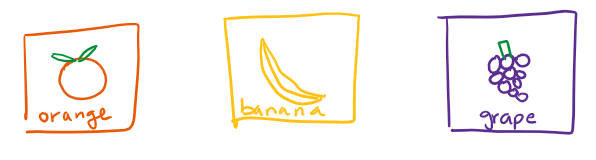

# Inheritance

## What is inheritance?

Essentially, it's a way of putting similar objects together to **generalize behavior.** Inheritance is best used with relating **subtypes** to larger categories. For example, an 🍊orange **is a** fruit \(so it's a **subtype** of fruit\). 

Let's say that a supermarket named _Jrader Toe's_ asks us to simulate fruits for them in an online system. We could do it like this:


Now, every fruit would need some of the same properties- like cost, weight, and name! So we would need to do something like:

```java
public class Orange {
    private String name = "Orange";
    private int cost;
    ...
    public Orange(int cost, ...) {
        this.cost = cost;
        ...
    }
    // lots of methods
    public String getName() { ...
```

This would be _really annoying_ to do for every single fruit! And they're all the same properties for every fruit so it would also be incredibly inefficient code-wise. **Inheritance gives a much better solution!**

Let's make a **Fruit** class and have all of our fruits **inherit from** that class.


This does amazing things because we can just create one single Fruit class that has all of the properties we need, and simply make our specific fruits inherit those properties.

```java
public class Fruit {
    private String name;
    private int cost;
    ...
    public Orange(String name, int cost, ...) {
        this.name = name;
        this.cost = cost;
        ...
    }
    // lots of methods
    public String getName() { ...
}

// Now for a very simple Orange method!
public class Orange extends Fruit {
    public Orange(int cost,...) {
        super("Orange", cost, ...);
    }
}
```

With only those 4 lines, 🍊Orange now has all of the same methods and properties that Fruit has!

## Method Overriding

Let's say that _Jrader Toe's_ is running a promotion for 🍐pears and wants to make them 20% off normal pears! This poses a problem because **we want to inherit everything that normal pears have, but change only one behavior** \(getPrice\). Well I've got the solution for you!!! And it's called **overriding.**

```java
public class PromoPear extends Pear {
    public PromoPear(int cost, ...) {
        super(cost, ...);
    }
    
    // Overriding the getPrice to have a new behavior only for PromoPears!
    @Override
    public int getPrice() {
        return super.getPrice() * 0.8;
    }
    ...
}   
```

The `@Override` tag is technically optional, but it's highly suggested because it makes sure that you are indeed overriding something and not just making a new method! \(Remember, it has to have the **same name and parameters as a method in one of its parents**.\)

## **Method Overloading**

Sometimes, you want to take in **different parameters** into the **same method.** For instance, what if we wanted to create a method `getCount(Fruit fruit)` that counts how many fruits of that type we have? We might also want to allow users to pass in the name of the fruit to do the same thing- `getCount(String fruit)`. Java will allow us to make **both** of these methods in the same class!

However, this has some major downsides that should be considered. 

* It's repetitive.
* It requires maintaining more code- changing one overload won't change the others!
* You can't handle any data types other than the ones you explicitly specify will work.

We'll discuss better solutions further down the page as well as in the [Generic Types](generics.md) page!

### How is overriding different from overloading?

They have very similar names but pretty different uses!

Overriding is for methods of the same name, **same parameters**, and **different classes.** If you can remember when you use the `@Override` tag, you can relate it back to this concept!

Overloading is for methods of the same name, **different parameters**, in the **same class**. 

## Interfaces

* Declared in the same way as classes: `public interface InterfaceName {}`
* Specifies the methods and variables contained, but not their implementation 
  * Can use **default** keyword to go around this restriction, but not recommended \(**Implementation inheritance**\)
    * Harder to keep track of implementation
    * Overly complex
    * Breaks encapsulation rules
* Allows generic types to be used in methods without overloading \(as long as they have the same methods\)
* **Method Overriding:** redefining the same methods in subclass as in superclass.
  * Priority will be given to subclass methods
  * Optional `@Override` tag helps with error checking and readability
  * **IMPORTANT:** Overridden methods MUST have the same signature!
* **Interface inheritance:** Term for specifying capabilities of subclasses using an interface
  * Subclasses must implement/override **all** of the interface methods!!
* **If X is a superclass of Y, then a variable of type X can hold a reference to Y!**
  * Uses methods from subclass
  * **Dynamic method selection:** Dynamic \(runtime\) types take priority over Static \(compiled\) types
* Example:

  ```java
  public interface AnInterface<Item> {
    public void doStuff(Item x);
    public Item getItem();
    default public void defaultStuff() {
        // Do stuff
    }
    ...
  }

  public class Something implements AnInterface<Item> {
   @Override
   public void doStuff(Item x) {
       // implement method
   }

   @Override
   public void getItem() {
       // implement method
   }
  }

  public class MainClass {
    public static void main(String[] args) {
        AnInterface<String> smth = new AnInterface<>();
        AnInterface<String> smthElse = new Something<String>(); // Will not error!
        smth.getItem();
        ...
    }
  }
  ```



## Implementation Inheritance \(Extends\)

* Used to specify a **hyponym** of an interface
* Adds new functionality to a superclass
* What is inherited:
  * All instance and static variables
  * All methods
  * All nested classes
* What is NOT inherited:
  * Private variables/methods
  * Constructors
* Constructors will **automatically** run the constructor of superclasses even if it is not explicitly called!!!
  * Will not run twice if explicitly called: can access non-default constructors this way
* **IMPORTANT:** Any class which does not explicitly extend another class will implicitly extend the Object class

```java
public class A {
    public void doSomething() { ... }
}

public class B extends A {
    @Override
    public void doSomething() {
        super.doSomething();
        // Do more things
    }

    public void doSomethingElse() { ... }
}

public static void main(String[] args) {
    A aa = new A();
    aa.doSomething(); // OK
    aa.doSomethingElse(); // ERROR
    B bb = new B();
    bb.doSomething(); // OK
    bb.doSomethingElse(); // OK
}
```

## Compile-Time Type Checking

* Compiler is more conservative about type checking than is actually allowed based on dynamic type checking
* Example:

  ```java
  B bb = new B();
  A aa = bb; // ALLOWED at compile time, since B is a subclass of A
  aa.doSomethingElse(); // NOT ALLOWED at compile time even though this would work!
  B AnotherBB = aa; // NOT ALLOWED at compile time because aa is assigned type A, and a static-type subclass cannot be dynamically assigned a superclass!
  ```

* Can be resolved using **Casting:** Telling Java to treat an expression like having a different compile-time type. In the example above, the last line can be changed to

  ```text
  B AnotherBB = (B)aa;
  ```

  which tells Java to treat aa like a B type class. Since aa is indeed type B, it will compile and run as expected.

  However, aa cannot be casted into an unrelated type, e.g. `String`. Doing so will result in a `ClassCastException` at runtime.

## Subtype Polymorphism

**Polymorphism:** Providing a single interface to entities of different types

* Common example: making objects extend a 'comparable' interface which specifies greater than, equals, etc. behaviors

**Dynamic method selection:** When using polymorphisms, Java selects the correct behavior based on the dynamic type, not the static type


### Still not satisfied?

Watch [Josh Hug's video lecture](https://www.youtube.com/watch?v=IaEq_fogI08&list=PL8FaHk7qbOD6km6LlaHLWgRl9SbhlTHk2) about inheritance.

